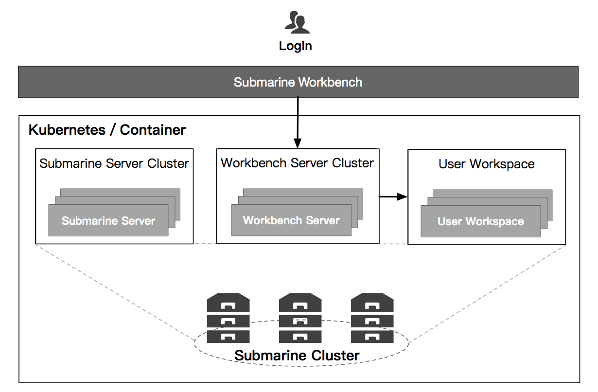
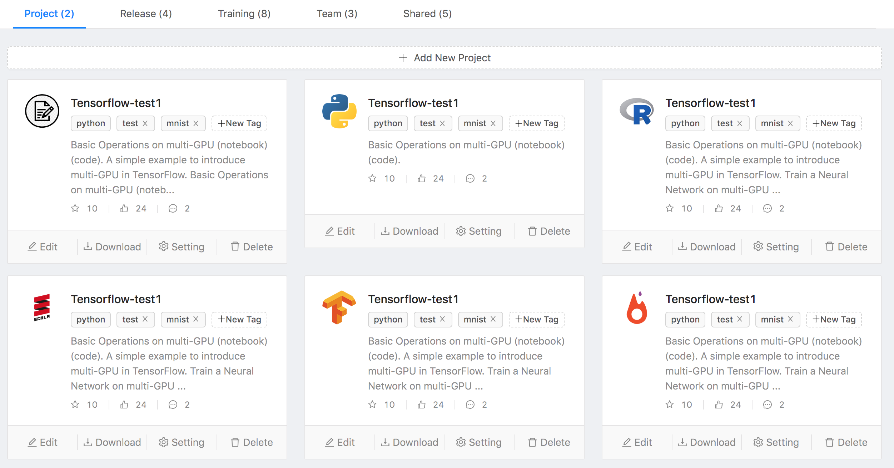
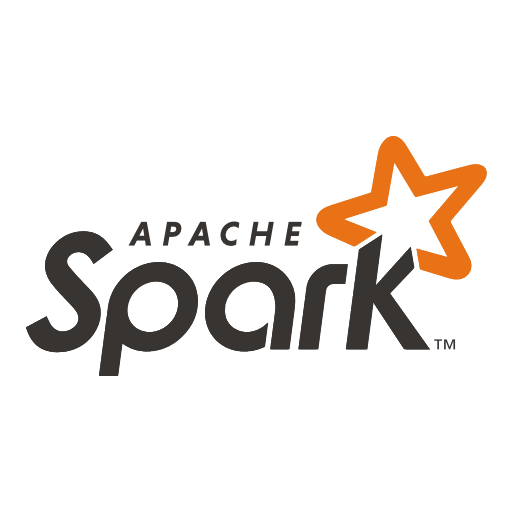
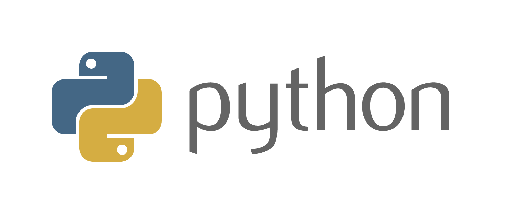

<!--
Licensed under the Apache License, Version 2.0 (the "License");
you may not use this file except in compliance with the License.
You may obtain a copy of the License at

http://www.apache.org/licenses/LICENSE-2.0

Unless required by applicable law or agreed to in writing, software
distributed under the License is distributed on an "AS IS" BASIS,
WITHOUT WARRANTIES OR CONDITIONS OF ANY KIND, either express or implied.
See the License for the specific language governing permissions and
limitations under the License.
-->

 
<h1 class="index-header">
  What is Apache Submarine?
</h1>

   

  

    <h1 style="color:#4c555a">ONE PLATFORM</h1>
    

      Submarine allow Data Scientists to create end-to-end machine learning workflow. (Working in progress)
    

    <ul style="list-style-type: none;padding-left:10px;" >
      <li style="font-size:18px; margin: 5px;"> Data Analytics</li>
      <li style="font-size:18px; margin: 5px;"> Algorithm development</li>
      <li style="font-size:18px; margin: 5px;"> Workflow</li>
      <li style="font-size:18px; margin: 5px;"> Job scheduling</li>
      <li style="font-size:18px; margin: 5px;"> Model Serving</li>
    </ul>
  

  

    
  

 
## Workbench
[Apache Submarine Workbench](https://github.com/apache/submarine/tree/master/docs/workbench) (working in progress) is a WEB system for data scientists. 
Data scientists can interactively access notebooks, submit/manage jobs, manage models, create model training workflows, access data sets, and more through Submarine Workbench.

<!--
### Notebook 
You can write code and run directly in the workbench through the notebook, using python or spark interpreter, and the results will be graphically displayed.

#### Submarine Spark Interpreter
The submarine workbench has integrated the spark runtime environment. The data engineer can directly write spark or spark sql for data processing without any configuration.

Apache Submarine with Spark integration provides

- Automatic SparkContext and SQLContext injection
- Provide the spark runtime environment through the docker image.
- Canceling job and displaying its progress

For the further information about Apache Spark in Apache Submarine, please see [Spark interpreter for Apache Submarine](#).

#### Python integration
The submarine workbench has integrated the python runtime environment and a rich python library. Data scientists can directly write python code for algorithm development without any configuration.

For the further information about Python in Apache Submarine, please see [Python interpreter for Apache Submarine](#).
-->

 
## Machine Learning Fromework

Submarine supports them in the form of plugins for different machine learning frameworks. Three machine learning frameworks, tensorflow, pytorch are currently supported. (Working in progress: Horovod/MXNet)

 
## Resource Management Independent

Submarine also designed to be resource management independent, no matter if you have Kubernetes, Apache Hadoop YARN or just a container service, you will be able to run Submarine on top it.

### YARN

Submarine can run in hadoop yarn with docker features

### Kubernetes (In-Progress)

Submarine developed a submarine operator to allow submarine to run in kubernetes.

### Docker (In-Progress)

Submarine can also be run on one or more servers with the docker runtime environment installed.
You only need to configure the server list in submarine-site.xml, submarine can automatically build these server groups into a cluster, and run submarine services and jobs in this cluster. This feature is very suitable for small-scale user scenarios.

## Roadmaps

Want to learn more about roadmap and release plan of Submarine? Please go to [roadmap](https://cwiki.apache.org/confluence/display/SUBMARINE/Roadmap)

Apache Submarine is Apache2 Licensed software. Please check out the [source repository](https://github.com/apache/submarine) and [how to contribute](/community/contributors.html).
Apache Submarine has a very active development community.
Please join our [Mailing list](/community/contributors.html) and report issues on [Jira Issue tracker](https://issues.apache.org/jira/browse/SUBMARINE).

 
