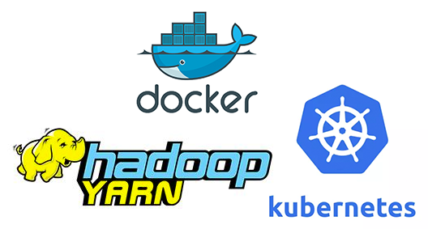

<!--
Licensed under the Apache License, Version 2.0 (the "License");
you may not use this file except in compliance with the License.
You may obtain a copy of the License at

http://www.apache.org/licenses/LICENSE-2.0

Unless required by applicable law or agreed to in writing, software
distributed under the License is distributed on an "AS IS" BASIS,
WITHOUT WARRANTIES OR CONDITIONS OF ANY KIND, either express or implied.
See the License for the specific language governing permissions and
limitations under the License.
-->


  

    <h2>Technologies</h2>
    

      

        

          <label class="_default-text" style="margin-top:20px;">
            
          </label>
          <label class="_hover-text">
            

              Submarine supports data processing and algorithm development using spark & python through notebook.
            

            <a href="/docs/0.7.2/interpreter/python.html" class="panel-button">USE NOW </a>
          </label>
        

      

       

         

           <label class="_default-text" style="margin-top: 20px;">
             
           </label>
           <label class="_hover-text">
             

               Submarine supports multiple machine learning frameworks for model training.
             

             <a href="/docs/0.7.2/interpreter/spark.html" class="panel-button">USE NOW </a>
           </label>
         

       

      

        

          <label class="_default-text" style="margin-top: 20px;">
            
          </label>
          <label class="_hover-text">
            

              Submarine supports Yarn, Kubernetes, Docker with Resource Scheduling.
            

            <a href="/docs/0.7.2/interpreter/spark.html" class="panel-button">USE NOW </a>
          </label>                     
        

      

    

    

      

        See more details in Submarine more feature.
        <a href="/docs/0.8.0-SNAPSHOT/manual/interpreters.html">LEARN MORE </a>
      

    

    

    

      <h2 style="padding-bottom: 8px;">ONE PLATFORM</h2>
      

        

          <label style="width: 100%;">
            

              
              End-To-End
            

          </label>
          <label class="content-text">
            Supports data scientists and data engineers to finish their jobs on the same platform without frequently switching their toolsets. 
            <a href="/docs/0.7.2/install/install.html" class="user-button">LEARN MORE</a>
          </label>
        

      

      

        

          <label style="width: 100%;">
            

              
              Resource Independent
            

          </label>
          <label class="content-text">
            No matter if you have Apache Hadoop YARN, K8s, or just a container service, you will be able to run Submarine on top it. 
            <a href="/docs/0.7.2/security/shiroauthentication.html" class="user-button">LEARN MORE</a>
          </label>                 
        

      

    

      

        See more details in Submarine more feature.
        <a href="/docs/0.8.0-SNAPSHOT/manual/interpreters.html">LEARN MORE </a>
      

    

    

  

